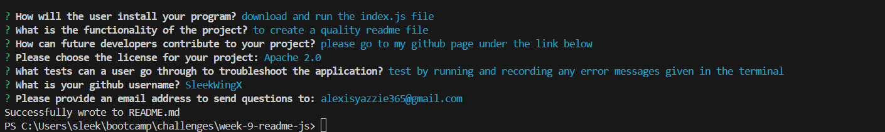
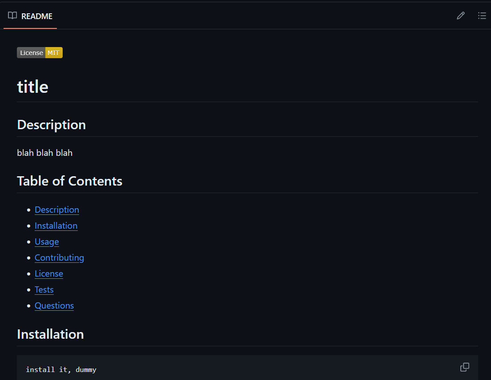
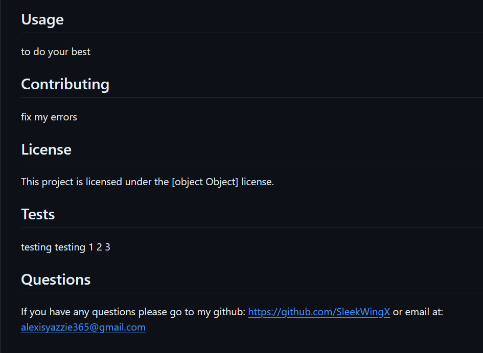

# README Creator

## Description
A javascript file using node.js and inquirer to create a readme file




A short video showing utility:
https://drive.google.com/file/d/14fM8o71F7nM_FaE7iN7EpxULvPQy2URf/view

## Table of Contents
- [Description](#description)
- [Installation](#installation)
- [Usage](#usage)
- [Contributing](#contributing)
- [License](#license)
- [Tests](#tests)
- [Questions](#questions)

## Installation
```
download and run the index.js file
```

## Usage
to create a quality readme file using user prompts and input

## Contributing
please go to my github page under the link below

## License
This project has no license.

## Tests
test by running and recording any error messages given in the terminal

## Questions
If you have any questions please go to my github:
https://github.com/SleekWingX 
or email at:
alexisyazzie365@gmail.com